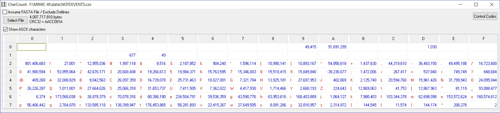

# CharacterCount

Compute frequency counts of all bytes in a file from hex 00 to hex FF

## Character Count programs

Character count programs compute the frequency counts of all bytes in a file, with values from hex 00 to hex FF.

The program is useful for determing if a file contains unusual or special ASCII characters, including

  * control characters, hex 00 - hex 1F, including tabs (hex 09), and line endings (hex 0D and or hex 0A),
  * unusual or unexpected characters, especially hex 7F through hex FF,
  * field separators and whether the count matches expected number of fields.

Programs include

  * **Delphi-Windows program**  Drag and drop file to process.

  * **Command-Line programs**  For use in scripts.

  * **Archive**  Several historical versions of this program back to 1980.

## Directories

   * Delphi-Windows.  Delphi source code used with Embarcadero RAD Studio 10.2 on 2018-06-30 to create CharCount.exe.

   * Command-line.  Extremely old C source code that still works.

The base directory contains Windows executable programs from the souce code in the directories above.

Examples:

** Windows **



Possible problems:

  * Line ends predominantly LFs (nearly 92 million hex 0As), but why 1030 hex 0Ds?
  * Nearly 50,000 tabs are in the file.  Can they cause problems?
  * What's the purpose for the 677 hex 13 and 49 hex 14 characters?
  * Why are two hex 7F characters in the file?

** Command Line**

```
charcnt charcnt.c
charcnt.c     1977 bytes     checksum:  129155

     0  1  2  3  4  5  6  7  8  9   A  B  C  D  E  F
     -  -  -  -  -  -  -  -  -  -   -  -  -  -  -  -
 0   0  0  0  0  0  0  0  0  0  0 107  0  0  0  0  0
 2 544  0 30  5  0  8  0  2 32 32  10 21 19  1 14  8
 3  23 18  7  2  5  3 20  0  2  1   4 44 11 22  8  2
 4   0  6 15 11 21 43 17 14  9 25   0  0  4 11 39 17
 5   1  0 26  7 17  1  0  7  2  3   0 36  9 36  0  2
 6   0 39  7 31 20 41 26 10 19 58  34  5 28 15 39 30
```

A typical ASCII text file using hex 0A (LF) terminators, common with a Linux system.

```
charcnt charcnt.exe
charcnt.exe    48984 bytes     checksum:  2450096

       0    1   2   3    4   5   6   7   8   9  A   B   C   D   E    F
       -    -   -   -    -   -   -   -   -   -  -   -   -   -   -    -
 0 20583  824 556 812  790 262 384  76 208  42 70  80 148  38 224  156
 1   135   23  27  27  166  59   7  14 127  15 14  68 138  15  10    9
 2   478    6  19   4  626  52  31  19 113  47 10  14  85 166 779   56
 3   128   65  37  71  191  79 269  67 168  56 44  11  55  35   8   27
 4   489  234  85 238  223 309  64 140  67 164 18  11 149 133 181  135
 5   129   18 158 189  264 180  58  80 140  18 23  36  53  19  19 1524
 6    48 1047 203 410  599 777 200 209  96 884 45  44 347 257 416  339
 7   314   73 563 521 1209 192  95 107 198  84 39   2  44  12   4    6
 8    58   33   8 200  116 111  22  13  43 187  2 145  22 101   4    3
 9   263    3   4   6   27   4   6   7  14   6  5   5  23   5   5    0
 A    26   59   7  22   14   2   4   3   9   3  4   4  17   0   1    4
 B    21    4   7   2   28   2  77  17  28  10  5  14  31   6   5    7
 C   138   16  19 107   64  20  34 164  27  20 16  13  60   6   5    3
 D    70   10  20   9   24   2  40  22  43  11 10  19  25  22   7    4
 E    32    3  12   4   20  11   6   4 128  25  3  44  81   3   5    6
```

A typical binary EXE file.


##  Background

In the early 1980s I had a [Heathkit H89 computer](https://en.wikipedia.org/wiki/Zenith_Z-89) with a [H14 printer](https://www.manualslib.com/manual/901753/Heathkit-H14.html).  When I tried to print text files downloaded from various places, noise characters sometimes appeared because of noisy phone lines.  Printing files with the "wrong" noise characters would burn out the print head!  This was frustrating and expensive.  "charcount" was a way to find if a file was safe to print.  In the end, I gave the printer away because it was too unreliable.

Later in the 80s, I struggled to make sense of a file that was half ASCII and half EBCDIC.  That was a pain to sort out.  "Seeing" unprintable characters was only possible by displaying a hex dump of a file.

Over the years, "bad" characters always unexpectedly popup when least expected, so charcount is a way to find them and fix them proactively before they unexpectedly cause problems.

THe *Archive* folder shows several early versions of the program.  The first from 1980 written in Microsoft FORTRAN was converted to UCSD Pascal (1982), which was convert to C (1990), ..., to Delphi (2001), ...  There may have been a PL/I version at some point.

Did I mention that I've used character count to identify and remove tabs in files?  Tabs (hex 09) not displayed consistently by many programs (one or more spaces), do not help with alignment of fields of variable width, and many computer users cannot "see" them to fix problems in files.  Most users cannot tell if they have a tab character or a number of blanks.

