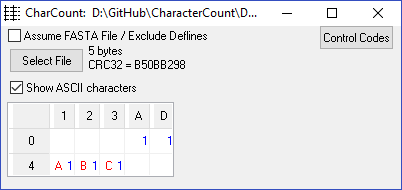
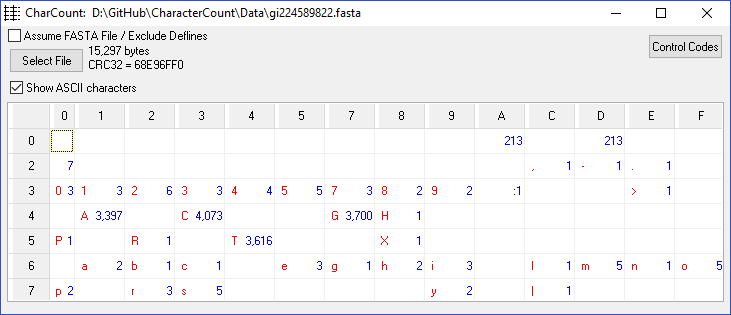
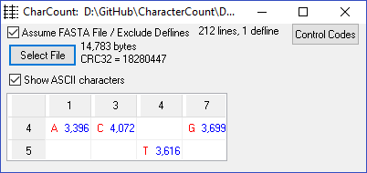

# CharacterCount

Utilities to read text or binary files to produce frequency counts of all characters in a file from hex 00 to hex FF.

The summary often shows unexpected characters in files, especially in very large files.

The result for a binary file will often show the full 16-by-16 matrix with counts for all 256 possible characters.

## Character Count programs

Character count programs compute the frequency counts of all bytes in a file, with values from hex 00 to hex FF.

The programs are useful for determining if a file contains unusual or special ASCII characters, including

  * control characters, hex 00 - hex 1F, including tabs (hex 09), and line endings (hex 0D and or hex 0A),
  * unusual or unexpected characters, especially hex 7F through hex FF,
  * field separators and whether the count matches expected number of fields.

Programs include

  * **Delphi-Windows program**:  Drag and drop file to explore on **CharCount.exe** to process.

  * **C Command-Line programs, charcnt and charcnt2**:  For use in scripts.

  * **Archive**  Several historical versions of this program back to 1980 (for my amusement).

## Directories

   * Delphi-Windows.  Delphi source code used with Embarcadero RAD Studio 10.2 on 2018-06-30 to create CharCount.exe.

   * Command-line.  Extremely old C source code that still works.

The base directory contains Windows executable programs from the source code in the directories above.

## Examples

### Windows CharCount

**Example 1:  MIMIC-III Clinical Data File**

Press **Select File** or drag and drop file on window for processing.


Possible problems to explore for this file:

  * Line ends predominantly LFs (nearly 92 million hex 0As), but why 1030 hex 0Ds?
  * Nearly 50,000 tabs are in the file.  Can they cause problems?
  * What's the purpose for the 677 hex 13 and 49 hex 14 characters?
  * Why are two hex 7F characters in the file?


**Example 2:  Small text file**

Use **abc.txt** file from Data directory.

Each line in an ASCII text file has a line-feed (x'0A') and carriage return (x'0D') at the end of each line. So, a simple text file with "ABC" also has two more characters if created with Windows.

If created in Linux, the file has a line-feed (x'0A') at the end of each line.

Press the *Control Codes* button to see a description of most values under x'20'.

To process a file, press the *Select File* button and select the file, or using Windows Explorer, simply drag and drop the file onto the middle of the window.




**Example 3:  DNA "fasta" file**

Use **gi224589822.fasta** from Data directory.

An ASCII text file with a DNA sequence in FASTA format might look like this, with many characters appearing in the file.  The file has 213 lines and was likely created in a Windows environment since the number of x'0A' and x'0D' characters are the same.

By default, all characters in the file are processed, so the header line spoils the nucleotide counts.



**Example 4:  Count nucleotides only in "fasta" file**

The FASTA file in Example 3 consists of a "Defline" as the first line, followed by 212 rows of DNA sequences that consist of only As, Cs, Gs and Ts.  To ignore the defline and only count the sequence nucleotides, check the *Assume FASTA File* box before processing the file.

Because of a minor bug, you must press "Select File" after checking the checkbox to process the file.



When the "Defline" is excluded, the file only contains A, C, G and T nucleotide characters.


### Command Line:  charcnt

Windows or Linux if compiled correctly.

**Example 4:  charcnt.c source code**

```
charcnt charcnt.c
charcnt.c     2135 bytes     checksum:  134503

     0  1  2  3  4  5  6  7  8  9   A  B  C   D  E  F
     -  -  -  -  -  -  -  -  -  -   -  -  -   -  -  -
 0   0  0  0  0  0  0  0  0  0  0 108  0  0 108  0  0
 2 544  0 30  5  0  8  0  2 32 32  12 21 20   5 16  8
 3  27 20  8  2  7  3 21  1  3  2   4 44 11  22  8  2
 4   0  6 15 11 22 42 17 13  9 25   0  0  4  11 39 18
 5   1  0 27  7 17  1  0  8  2  3   0 36  9  36  0  2
 6   0 40  8 31 19 45 28 13 20 60  34  5 30  16 39 31
 7  16  7 44 13 52 14  7 15 24  3   0  2  0   2  0  0
```

A typical ASCII text file using hex 0A (LF) terminators, common with a Linux system.

### Command Line:  charcnt2

**Example 5:  charcnt.c source code (again)**

**charcnt2** returns the frequency matrix as one long vector with a final total bytes column (shown wrapped below):

```
charcnt2 charcnt.c
charcnt.c,0,0,0,0,0,0,0,0,0,0,108,0,0,108,0,0,0,0,0,0,0,0,0,0,0,0,0,0,0,0,0,0,544,0,30,5,0,8,0,2,32,32,12,21,20,5,16,8,27,20,8,2,7,3,21,1,3,2,4,44,11,22,8,2,0,6
,15,11,22,42,17,13,9,25,0,0,4,11,39,18,1,0,27,7,17,1,0,8,2,3,0,36,9,36,0,2,0,40,8,31,19,45,28,13,20,60,34,5,30,16,39,31,16,7,44,13,52,14,7,15,24,3,0,2,0,2,0,0,0
,0,0,0,0,0,0,0,0,0,0,0,0,0,0,0,0,0,0,0,0,0,0,0,0,0,0,0,0,0,0,0,0,0,0,0,0,0,0,0,0,0,0,0,0,0,0,0,0,0,0,0,0,0,0,0,0,0,0,0,0,0,0,0,0,0,0,0,0,0,0,0,0,0,0,0,0,0,0,0,0
,0,0,0,0,0,0,0,0,0,0,0,0,0,0,0,0,0,0,0,0,0,0,0,0,0,0,0,0,0,0,0,0,0,0,0,0,0,0,0,0,0,0,0,0,0,0,0,2135
```

This may help in creating file features for machine learning applications.

The charcnt2 file can be collected and edited in Excel for comparison of a set at at time.

**Example 6:  charcnt Windows executable**

```
D:\GitHub\CharacterCount\Command-Line>charcnt charcnt.exe
charcnt.exe    48984 bytes     checksum:  2460263

       0    1   2   3    4   5   6   7   8   9  A   B   C   D   E    F
       -    -   -   -    -   -   -   -   -   -  -   -   -   -   -    -
 0 20414  830 556 812  704 262 384  75 237 126 70  80 144  47 219  149
 1   155   22  27  29  162  58   9  11 124  15 16  29 156  41   6   12
 2   475    7  19   4  628  52  30  18 111  47 11   8  80 177 779   56
 3   139   65  37  71  195  79 270  66 170  60 45  11  41  36   8   28
 4   501  240  85 237  234 309  64 140  73 161 19  12 151 133 182  134
 5   121   18 156 189  269 180  97  96 138  18 23  37  68  19  19 1525
 6    60 1047 203 410  595 778 203 209  93 885 45  44 354 256 417  339
 7   313   73 566 523 1211 192  95 110 199  84 38   2  44  12   4    6
 8    55   33   8 201  104 112  22  13  47 196  3 156  19 101   6    3
 9   269    4   5   6   32   4   6   7   8   6  5   5  22   5   4    0
 A    14   59   9  21   14   3   4   3  10   2  3   4  13   0   3    5
 B    13    4   6   1   33   3  77  17  29   9  5  14  31   6   4    7
 C   155   21  15 107   95  18  35 167  32  19 11  10  65   8   4    3
 D    42    8  23  18   24   2   2   5  37  12 10  20  14  24   9    4
 E    31    3  10   5   22  10   7   4 127  25  3  44  82   3   5    5
 F    46    6   3   7   34   0  25  33  61   4 11  14  22  14  51  493
```

This is typical of the pattern for a binary EXE file.


## Background

In the early 1980s I had a [Heathkit H89 computer](https://en.wikipedia.org/wiki/Zenith_Z-89) with a [H14 printer](https://www.manualslib.com/manual/901753/Heathkit-H14.html).  When I tried to print text files downloaded from various places, noise characters sometimes appeared because of noisy phone lines.  Printing files with the "wrong" noise characters would burn out the print head!  This was frustrating and expensive.  "charcount" was a way to find if a file was safe to print.  In the end, I gave the printer away because it was too unreliable.

Later in the 80s, I struggled to make sense of a file that was half ASCII and half EBCDIC.  That was a pain to sort out.  "Seeing" unprintable characters was only possible by displaying a hex dump of a file.

Over the years, "bad" characters always unexpectedly popup when least expected.  *Character count* is a way to find problems and fix them proactively before they unexpectedly cause problems.

The *Archive* folder shows several early versions of the program.  The first from 1980 written in Microsoft FORTRAN was converted to UCSD Pascal (1982), which was converted to C (1990), ..., to Delphi (2001), ...  There may have been a PL/I version at some point.

Did I mention that I've used *character count* to identify and remove tabs in files?  Tabs (hex 09) are not displayed consistently by many programs (variable number of spaces), do not help with alignment of fields of variable width, and many computer users cannot "see" tabs to fix problems in files.  Most users cannot tell if they have a tab character or a number of blanks.

## Building executables

**Windows**

Delphi source code was compiled with Embarcadero RAD Studio 10.2 on 2018-07-20 to create **CharCount.exe**.

In Windows with Rtools installed, there is a gcc compiler for the command-line tools **charcnt** and **charcnt2**:  c:\Rtools\mingw_32\bin\gcc.exe

With C:\Rtools\mingw_32\bin in the path, compile as follows:

```
gcc charcnt.c  legible.h -ocharcnt
gcc charcnt2.c legible.h -ocharcnt2
```

The *sizes.c* program shows how to verify 32- and 64-bit integers, signed or unsigned, can be correctly displayed.

**Linux**

**charcnt** is quite old, but still compiles with the make file in CentOS:

```
make -f charcnt.mak
make -f charcnt2.mak
```

To annoy C experts who hated Delphi and Pascal in the early 1990s, I created the "legible.h" C macros to make C look like Pascal.  That was liked even less.

